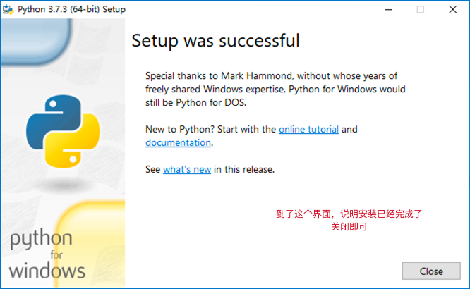

LeeClientAgent 说明
=============================================

LeeClientAgent 是用来管理 LeeClient 的一套脚本程序, 它位于 LeeClient/Utility 
目录下, 功能比较多, 回头大家自己探索.

很多人提问为什么下载完成 LeeClient 之后默认没有可执行程序, 这是因为你还没有告诉
LeeClient 你需要什么样的客户端版本. 使用 LeeClientAgent 切换相关的客户端版本后,
进入游戏时需要用到的可执行程序才会自动出现在 LeeClient 的根目录.

为了能够运行这套程序, 你必须做一些准备工作, 首先你需要安装 Python 3.7.x 或更高版本.
然后安装 LeeClientAgent 所需要的依赖库. 说起来复杂, 其实挺简单:

第一步: 下载 Python 3.7.x
--------------------------------------------

请直接前往 https://www.python.org/downloads/windows/ 下载安装程序. 我们优先选
用它的稳定版本(Stable Releases).

- 若您是 64 位操作系统的话, 下载 `Windows x86-64 executable installer` 即可.
- 若您是 32 位操作系统的话, 下载 `Windows x86 executable installer` 就可以了.

第二步: 安装 Python 3.7.x
--------------------------------------------

下载完成安装程序后, 直接运行启动它, 在第一个界面中按以下说明进行安装:


若您是第一次安装, 那么安装完成到末尾会有一个选项, 需要您启用它:


最终如果你看到如下图的选项, 那么就说明安装过程已经成功结束了:



第三步: 确认 Python 能正常工作
--------------------------------------------

安装完成之后, 打开一个新的 `终端` 或者 `cmd` 窗口, 输入以下两个指令进行测试, 只要
能够显示出内容 (而不是提示指令不存在), 那么就代表安装成功了.

我们先输入以下指令来测试 python 指令是否可用:

```
python --version
```

如果 python 指令可用, 那么会显示当前安装的 python 版本号. 例如:

```
C:\Users\Sean>python --version
Python 3.7.1
```

接下来我们输入以下指令来测试 pip 指令是否可用:

```
pip --version
```

如果 pip 指令可用, 那么会显示当前安装的 pip 版本号和安装位置. 例如:

```
C:\Users\Sean>pip --version
pip 19.1.1 from c:\users\sean\appdata\local\programs\python\python37\lib\site-packages\pip (python 3.7)
```

第四步: 安装 LeeClientAgent 的依赖项
--------------------------------------------

请用在你的 `终端` 或者 `cmd` 中使用 cd 指令切换到你 LeeClient/Utility 目录中去.
然后使用以下指令来安装依赖项:

```
pip install -r requirements.txt
```

如果速度太慢的话, 可以参考一些教程, 把你的 pip 设置为从`阿里云`镜像来下载各种库文件,
这样速度会有大幅提升: https://www.jianshu.com/p/e2dd167d2892 (参考其中的"永久
修改"章节, 后面的 "命令行操作" 章节不用看)

第五步: 复制一份自己的配置文件
--------------------------------------------

在 LeeClientAgent 中有一些配置选项, 需要您进行设置. 请复制一份 `Utility/LeeClientAgent.yml.sample` 并将文件名修改成 `LeeClientAgent.yml`.

请打开它, 并根据需要去修改里面的配置选项. 这些选项一般和打包、制作安装程序相关,
若您前期不需要用到它的话, 可以维持默认内容, 什么都不要修改.

第六步: 启动 LeeClientAgent.py
--------------------------------------------

当上述步骤全部准备完毕之后, 您可以直接双击 `LeeClientAgent.py` 文件, 看到
以下界面的话就说明成功了:


